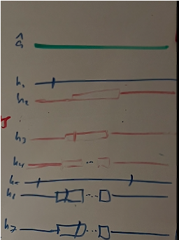
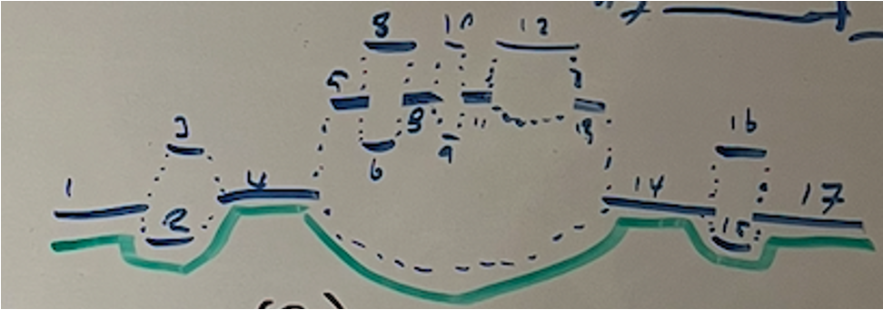
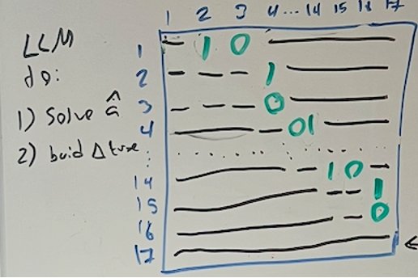
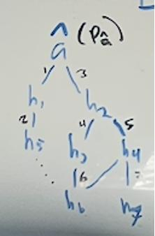
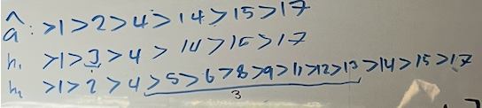
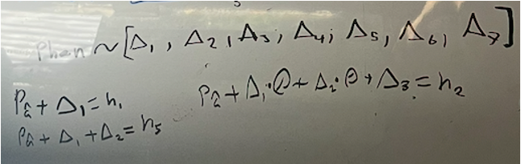
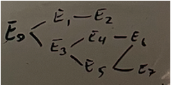
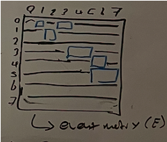
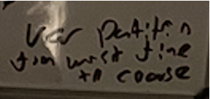
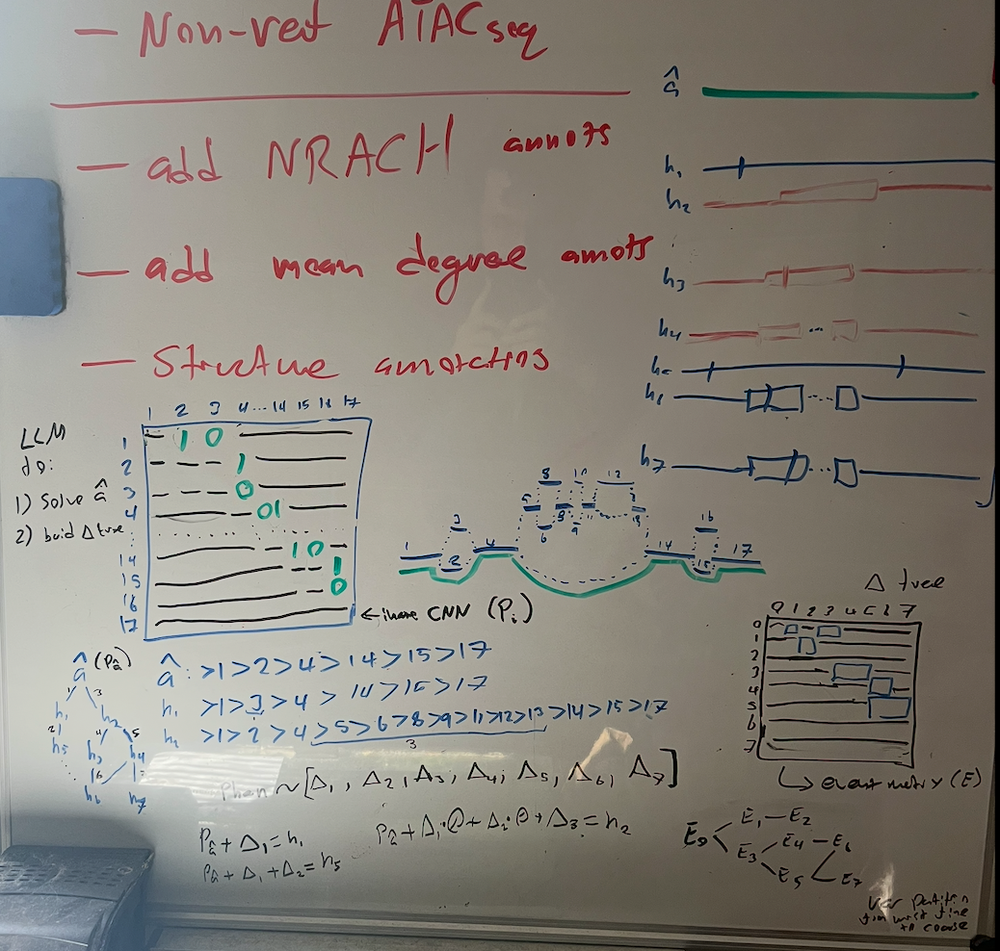

# Overview
I spent some time thinking through how to use graphs to perform an association study over some interval of genome space.
Specifically by leveraging the graph structure to make a haplotype reconstruction to the most recent common ancestor (MRCA) of a set of haplotypes making up the graph.

Starting with a set of haplotypes. In this case the ancestral haplotype I denote as $a$ with the estimate of the MRCA as $\hat{a}$. Shown here in green.
Here I show 7 haplotypes, $h_1, h_2, h_3, h_4, h_5, h_6, h_7$ which descend from the MRCA $\hat{a}$ after a series of mutations.

In this thought experiment, We only have the haplotypes $h_3, h_4, h_5, h_6, h_7$ available to us. We do not have $h_1$ or $h_2$.
To show the case wherein we only have the extant haplotypes and not all intermediate haplotypes.
This we weave into a genome-graph using the minigraph-cactus approach.

Though not encoded I draw on the ancestral haplotype $\hat{a}$. Here I am one of the haplotypes is the reference genome. But this is not really a reference genome centric thought experiment.
Each variable sequence segment is assigned an index number.
This is a directed acyclic graph (DAG) where each haplotype is a path through the graph.

Conceptually, we can construct a link structure matrix $L_i$ that describes the path of each haplotype through the graph.
Where each row is a source node and each column is a sink node.
Black dash lines indicate that link is not present in any haplotype, and thus in the valid search space.
This is important because things will blow up if we try to traverse non-existent paths. Though you can imagine recombination events that would create new paths.
The value (in green) in the matrix is binary, 1 if the link is traversed by a haplotype, 0 if not.

From this conception we can (with some constraints over cycles) enumerate all possible paths through the graph.
This is a combinatorial problem, and the number of paths can grow very quickly.
But I postulate that from a sufficiently large set of haplotypes, the MCRA path must be in the enumerated set of possible paths.

From the full set of possible paths, We can embed them in a latent space and from that find path that is closest to geometric center of the observed haplotypes.
My logic here is that we can step one mutation at a time from the MRCA to each extant haplotype.
From this we can find the consensus set of paths that minimize branch length to each extant haplotype.
This give us the MRCA estimate and a set of intermediate haplotypes that lead to the extant haplotypes.
This means we get a consensus haplotype tree. In this naive scenario the observed haplotypes make up most of the tree.

Given this tree of haplotypes, we then solve for Delta matrices ($D_j$, which is a matrix of the same shape as the link structure matrix, but instead of binary values, it contains +1/0/-1 values, such that by summing the Delta matrix for a given haplotype to the prior haplotypes link structure matrix, we get the link structure matrix for the given haplotype) that describe the mutation events that lead from the MRCA to each extant haplotype.

So to go from $\hat{a}$ to $h_5$, we sum to the link structure matrix for $\hat{a}$ the Delta matrices $D_1$ and $D_2$.
To go from $\hat{a}$ to $h_2$, we sum to the link structure matrix for $\hat{a}$ the Delta matrix $D_3$.

So we can describe each haplotype as a linear model with each Delta matrix as a feature, which is multiplied by 0 if that haplotype does not transition through that Delta matrix, or 1 if it does.

I also decided to then build a tree that chains the Delta matrices together. Such that each application or not of a Delta matrix is a branch point in the tree, each we call an event so $E_k$.

In order to actually have the Delta matrices be valid, they have to be applied in a certain order. Which means there is a tree structure to the application of the Delta matrices.

We can represent this tree as a binary matrix, where each row is a source event, and each column is a sink event.
$E_0$ is the root event, which is the MRCA $\hat{a}$.

Here the black lines indicate that the event is not reachable from the source event. Blue boxed elements are possible events that can be reached from the source event.

This is sort of backwards in explanation, since the tree and matrix had to be solved to get to the linear model representation of the haplotypes.
So forgive that. Because Deltas derive from the events tree/matrix. So how do we then used this?

Back to the linear model representation of the haplotypes. What we do is we perform analysis of variance as we traverse the events tree.

I think we do it from the leaves to the root. So we take all observed paths through the events tree down to the leaves.
Then we see how much variance we see within/between terminal haplotype groups. With and without a given event considered.

So in this example, we have 5 observed haplotypes, $h_3, h_4, h_5, h_6, h_7$.

Each is constructed by applying a series of events to the MRCA $\hat{a}$.

So starting at the terminal events, we remove the event, which effectively collapses it to the parent haplotype(s).
So that for the whole set of individuals we have one set of groups with the event, and one set of groups without the event.
Then we can perform an ANOVA to see how much variance is explained by the event.

In this way we make our way up the tree to the root event, which is the MRCA $\hat{a}$.

From this we solve for the traversal (haplotype grouping) that explains the most variance in the phenotype.

So we need to compare that to some null model or we need to calculate a likelihood ratio. So we can look at this over genomic intervals.

The null could be that variation in phenotype is not explained by any event in the tree. So maybe treating only having the ancestral haplotype $\hat{a}$ as the null for a LRT.
Or we could do randomization/permutation tests.

## Full white board:

