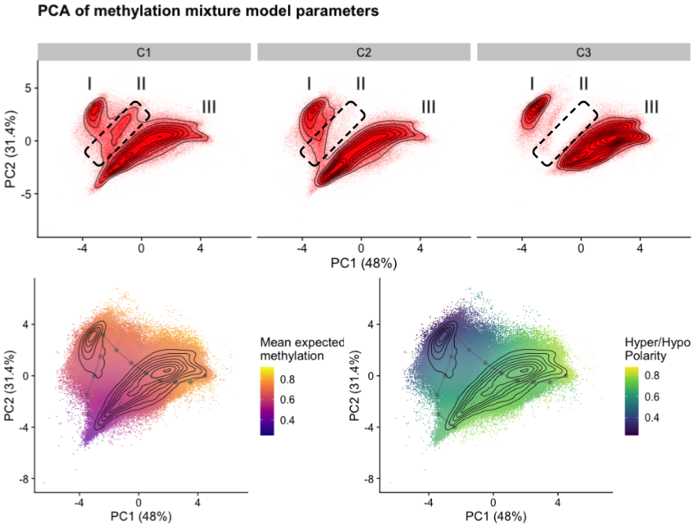

I think I figured out what those clusters Tianjie detected are.
By forcing it to cluster across haplotypes genome-wide, I think we effectively coerced the clustering into picking up global (non-genetic) cell states.
Which was I think the consensus we reached must be the case yesterday (panepigenome meeting).

So, I realized if that is the case then the work I did towards modeling methylation over regions (i.e. methylation domains) should match his results.

Basically, I segment the genome and model the distribution of methylation as a mixture model. Then I used a PCA to view the observed parameter space in two dimensions. Each point in that PCA space corresponds to a distribution shape.
There are there are three distributional-shape-clusters to my eye.

Roughly corresponding to regions that are:
- Highly polarized and can inhabit hypo up to hyper methylated, probably corresponding to Hyper/Hypo-methylated domains tightly regulated
- Intermediate polarization with a more narrow range of expected methylation values
- And low polarization with a narrow range of expected methylation values

