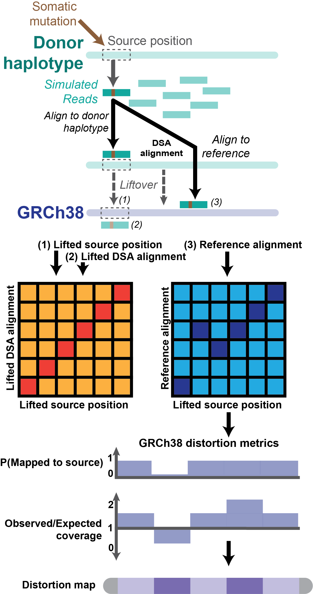

## Overview
In this document I will draft an outline for my MoRGANA manuscript and the main figures around which the study is structured.

## Outline

- Background on reference bias and genome choice literature
- Impact on signal accumulation assays
- Description of the HRPC resource and pCLAI annotations
- How we can use the HPRC2 haplotypes to model assays; introduce MoRGANA;
- MoRGANA illustration and intended use cases
- Description of assemblies and PCLAI annotations over cCRE annotations
- cCRE liftover statistics
- Running MoRGANA and description of resource usage on cCRE spaces
- Description of distortions over cCRE spaces
- OMIM and clinvar intersection
- Running MoRGANA on GENCODE using HPRC2 kinnex annotations
- Description of distortions over gene spaces
- flux maps to PAV annotations
- Cherry picked example where we fully explain how the distortion happened
## Sections
- [ ] Abstract

- [ ] Introduction

- [ ] Results

- [ ] Discussion

- [ ] Methods

- [ ] Supplement

- [ ] Citations

## Notes

## Figure 1

Figure legend:

The above figure needs to be remade and replaced. I need to add to it as well
